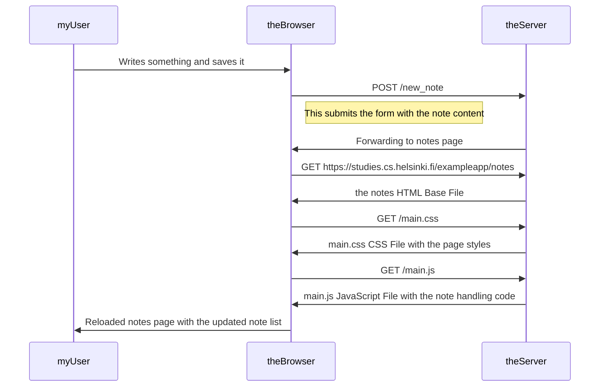
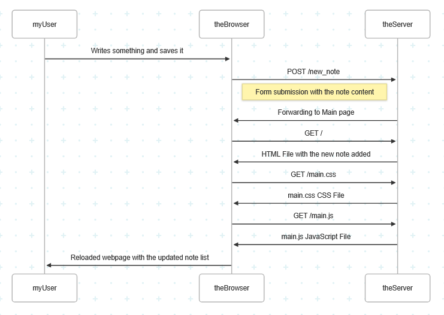

New Note Diagram

```mermaid
sequenceDiagram
    participant myUser
    participant theBrowser
    participant theServer

    myUser->>theBrowser: Writes something and saves it
    theBrowser->>theServer: POST /new_note
    Note right of theBrowser: This submits the form with the note content

    theServer->>theBrowser: Forwarding to notes page
    theBrowser->>theServer: GET https://studies.cs.helsinki.fi/exampleapp/notes
    theServer->>theBrowser: the notes HTML Base File

    theBrowser->>theServer: GET /main.css
    theServer->>theBrowser: main.css CSS File with the page styles

    theBrowser->>theServer: GET /main.js
    theServer->>theBrowser: main.js JavaScript File with the note handling code

    theBrowser->>myUser: Reloaded notes page with the updated note list
```

