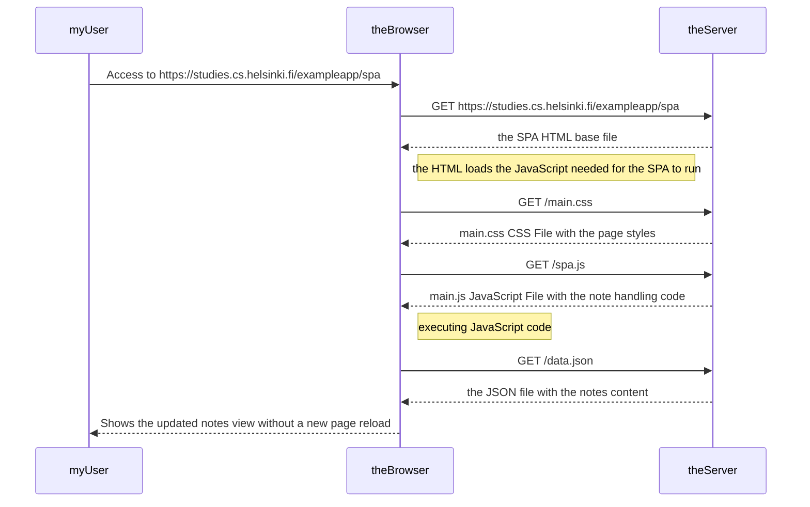
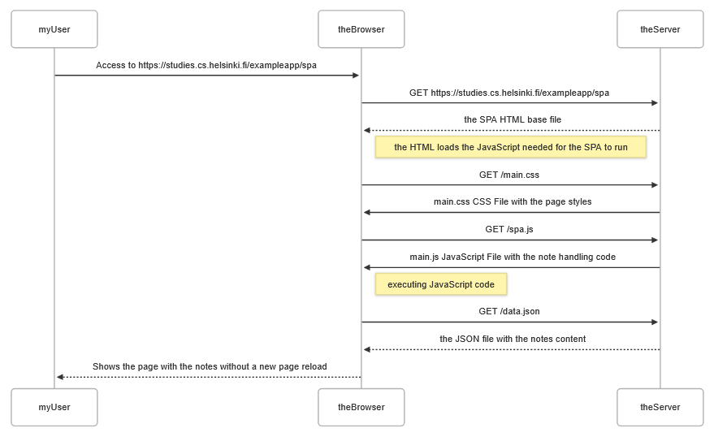

Single Page App (SPA) Diagram

```mermaid
sequenceDiagram
    participant myUser
    participant theBrowser
    participant theServer

    myUser->>theBrowser: Access to https://studies.cs.helsinki.fi/exampleapp/spa
    theBrowser->>theServer: GET https://studies.cs.helsinki.fi/exampleapp/spa
    theServer-->>theBrowser: the SPA HTML base file

    Note right of theBrowser: the HTML loads the JavaScript needed for the SPA to run

    theBrowser->>theServer: GET /main.css
    theServer-->>theBrowser: main.css CSS File with the page styles

    theBrowser->>theServer: GET /spa.js
    theServer-->>theBrowser: main.js JavaScript File with the note handling code

    Note right of theBrowser: executing JavaScript code

    theBrowser->>theServer: GET /data.json
    theServer-->>theBrowser: the JSON file with the notes content

    theBrowser-->>myUser: Shows the updated notes view without a new page reload
```

