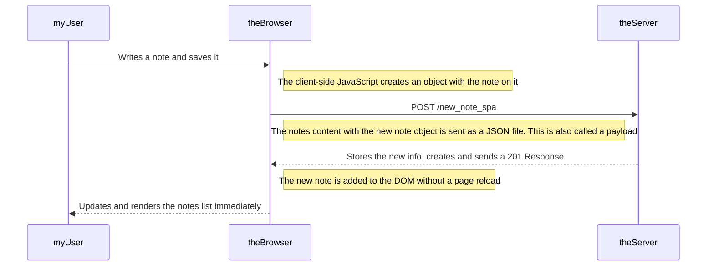
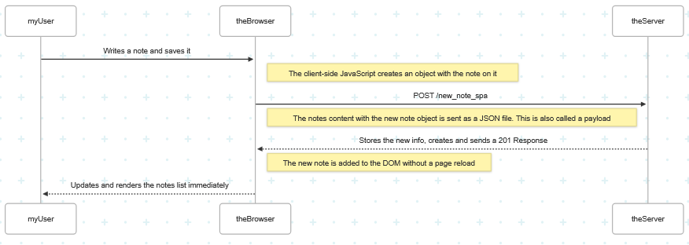

New Note in Single Page App Diagram

```mermaid
sequenceDiagram
    participant myUser
    participant theBrowser
    participant theServer

    myUser->>theBrowser: Writes a note and saves it
    Note right of theBrowser: The client-side JavaScript creates an object with the note on it

    theBrowser->>theServer: POST /new_note_spa 
    Note right of theBrowser: The notes content with the new note object is sent as a JSON file. This is also called a payload
    theServer-->>theBrowser: Stores the new info, creates and sends a 201 Response

    Note right of theBrowser: The new note is added to the DOM without a page reload

    theBrowser-->>myUser: Updates and renders the notes list immediately
```

